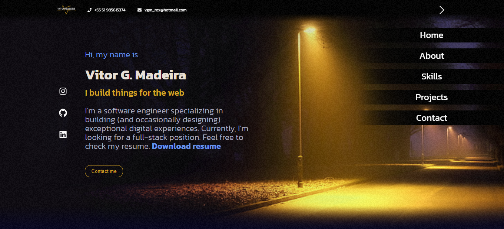

# Personal-Portfolio 

This is my personal Portfolio where I showcase my main projects. You can also check all my contact information. It was mainly built using React and a few other frameworks.

# Quick view

# Live Demo Version

https://TalhaNajeeb.netlify.app/

## Getting Started

- Clone this repository by running `https://github.com/TalhaAkhun/Portfolio-Template-2.git` in your CLI.
- Type `cd Portfolio-Template-2`
- Type `code .`
- Run `npm install`
- Run `npm start`
- Open Browser `http://localhost:3000/`

## Author1

👤 **Talha Najeeb** 🧑🏻‍💻
- GitHub: [@talhaAkhun](https://github.com/TalhaAkhun)
- LinkedIn: [Talha Najeeb](https://www.linkedin.com/in/TalhaNajeeb/)

## 🤝 Contributing

Contributions, issues, and feature requests are welcome!
Feel free to check the [issues page](https://github.com/TalhaAkhun/Portfolio-Template-2/issues).

## Show your support

Give a ⭐️ if you like this project!

## 📝 License

This project is [MIT](./MIT.md) licensed.
